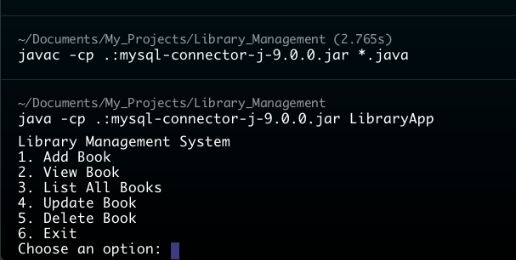
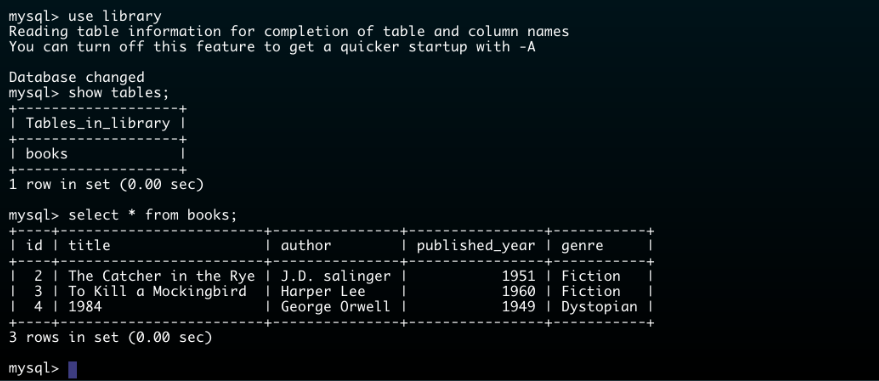

# Library Management System

## Overview

This Library Management System is a Java application demonstrates how to manage a library's book collection using `Java and MySQL`. It focuses on understanding and applying **Object-Oriented Programming (`OOP`)** concepts, such as encapsulation, inheritance, and abstraction, in a practical context.

## Screenshots





## Project Description

This project provides a command-line interface to manage books in a library. Users can:

- **Add a new book** with details such as title, author, published year, and genre.
- **View a specific book** by its ID.
- **List all books** in the library.
- **Update an existing book**'s details.
- **Delete a book** by its ID.

The application connects to a MySQL database to perform these operations and provides a basic yet functional example of how to handle database interactions in Java.

## Prerequisites

- **Java Development Kit (JDK):** Ensure that you have JDK 8 or later installed on your system.
- **MySQL Database:** You need a MySQL server running and a database created for this project.
- **MySQL JDBC Driver:** The MySQL JDBC driver JAR file (`mysql-connector-java-x.x.x.jar`) is required.

## Setup Instructions

1. **Clone the Repository:**

```bash
git clone https://github.com/hari-shadow/library-management-system.git
cd library-management-system
```

2. **Setup MySQL Database:**

   - Log in to MySQL:
```bash
mysql -u root -p
```
   - Create the database and table:
```sql
CREATE DATABASE library;
USE library;

CREATE TABLE books (
	id INT AUTO_INCREMENT PRIMARY KEY,
	title VARCHAR(255) NOT NULL,
	author VARCHAR(255) NOT NULL,
    published_year INT NOT NULL,
    genre VARCHAR(255) NOT NULL
     );
```

3. **Compile the Java Files:**

   Make sure the MySQL JDBC JAR file (`mysql-connector-java-x.x.x.jar`) is in the same directory as your `.java` files. Compile the Java files using:

```bash
javac -cp .:mysql-connector-java-x.x.x.jar *.java
```

4. **Run the Application:**

   Execute the `LibraryApp` class with the MySQL JDBC JAR file in the classpath:

```bash
java -cp .:mysql-connector-java-x.x.x.jar LibraryApp
```

   - For Windows, use `;` instead of `:`:

```bash
java -cp .;mysql-connector-java-x.x.x.jar LibraryApp
```

